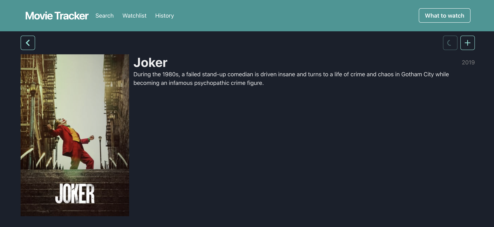
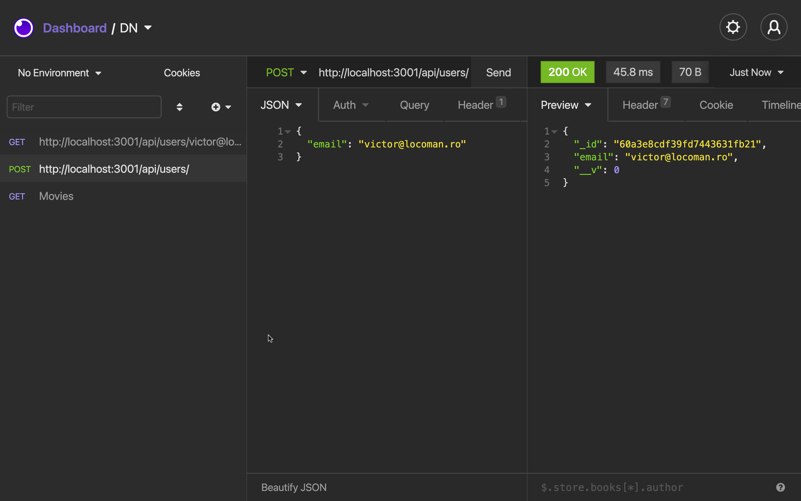
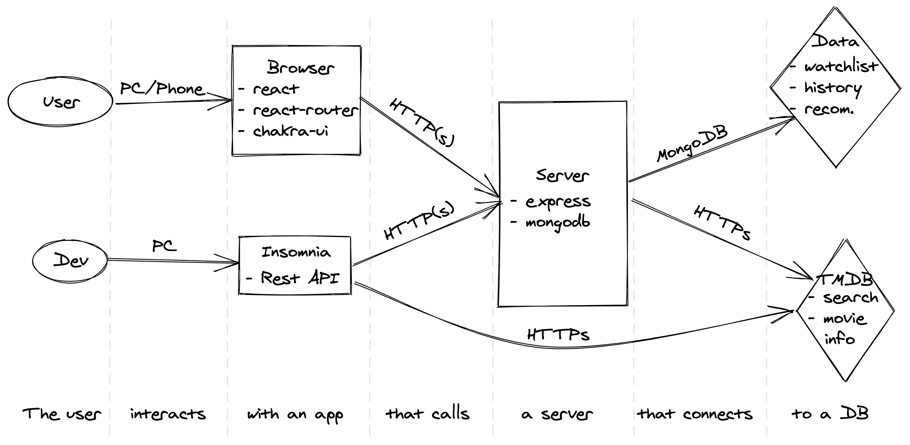

# Movie tracker



## Primii pași

1. Fork la acest repo
2. `git clone` la forkul nou creat (nu acest repo)
3. `npm install` pentru a descărca toate dependențele necesare
4. Creează un branch nou `project` din `main` și lucrează pe el
5. Oferă-mi access la fork, de pe GitHub `settings/access`, invită un colaborator, caută
   `victor@locoman.ro`
6. Adaugă 1-2 colegi la colaboratori ca să vă ajutați reciproc prin feedback la cod/soluție
7. Copiază fișierul `.env.example` în `.env` și completează-l

## Rularea proiectului

1. rulează instrucțiunea `npm run start:server` - va porni serverul
2. intră pe http://localhost:3001/api/, ar trebui să vezi mesajul "API not found"
3. deschide insomnia și adaugă o colecție nouă, apoi testează ruta de mai sus. Ar trebui să vezi
   același mesaj.
4. Adaugă ruta pentru crearea unui utilizator:
   - URL: `http://localhost:3001/api/users/`
   - Method: `POST`
   - Body (JSON): `{"email": "..."}`
   - Apoi send, ar trebui să apară asemănător ca și în imagine
5. Verifică că datele s-au salvat, prin `GET users/:email`



## Tehnologii folosite

### [express](https://expressjs.com/en/4x/api.html)

Se ocupă de server, ne permite să definim rutele.

### [nodemon](https://nodemon.io/)

Reîncarcă serverul când modificăm fișierele lui.

### [mongodb](https://docs.mongodb.com/drivers/node/usage-examples)

O bază de date populară.

### [TMDB](https://developers.themoviedb.org/3/search/search-movies)

The Movie Database oferă un API puternic, bogat în funcționalități. De la ei vom lua filmele și tot
ce ne interesează despre filme.

### [Insomnia](https://insomnia.rest/)

O aplicația prin care vom putea comunica ușor cu serverul nostru și cu TMDB.

---

### [react](https://reactjs.org/docs/hello-world.html)

Se ocupă de UI. Noi scriem componente care depind de `state`. React are grijă să afișeze în DOM
componentele noastre în dependență de `state`. Matematic vorbind:

```
UI = React(state)
```

Folosim [🪝hooks](https://reactjs.org/docs/hooks-intro.html) pentru cod frumos.

### [create-react-app](https://create-react-app.dev/docs/documentation-intro)

Pentru a face React corect, avem nevoie de mai multe instrumente, care îngreunează mult folosirea
React-ului. Din fericire, avem acest instrument care are grijă să configureze toate acele
instrumente și ne lasă pe noi să facem partea frumoasă.

### [react-router](https://reactrouter.com/web/guides/quick-start)

La fel cum express se ocupă de rutare pe server, acest instrument se ocupă de rutare în UI. Mai
întâi definim rutele existente prin `Route`, apoi înlocuim `anchor` tag cu `Link` component și de
restul se ocupă instrumentul.

### [chakra-ui](https://chakra-ui.com/docs/principles)

Ne permite să scriem CSS fără să scriem CSS 🤩. Și mai are și multe componente gata făcute. Nu e
nevoie să-l folosiți pentru a scrie cod, CSS-ul poate fi folosit în continuare. Dar, există opțiunea
să o faceți mai simplu, diferit.

### [react-query](https://react-query.tanstack.com/overview)

Are grijă de operațiile async din React.

### Q: E necesar să folosesc toate aceste instrumente?

A: Nu e necesar, sunt doar alegerea mea. Te invit să înlocuiești oricare din ele după bun plac. E un
exercițiu bun să faci același proiect cu tehnologii diferite.

## Arhitectura aplicației

### Problema

Utilizatorul dorește să privească un film și are nevoie de ajutor să aleagă filmul potrivit.

### Soluția

Ii oferim o aplicație prin care să poată salva filmele favorite și filmele privite. Pe baza acestor
informații vom oferi recomandări.

Vom face o aplicație web unde utilizatorul va putea căuta filmele preferate, și apoi le poate salva
în favorite/istoric. Informația despre filme va fi luată de pe TMDB prin API-ul lor. Stocarea
informațiilor se va face în baza noastră de date, care o vom putea accesa printr-un server.
Recomandările le vom face pe baza informațiilor din BD.



## Structura proiectului

- `server`
  - `index.js` - aici pornește serverul
  - `db.js` - ne conectăm la MongoDB
  - `tmdb.js` - utilități pentru conectarea la TMDB
  - `routes` - rutele de pe server
  - `models` - modelele de mongoose
- `dom` - UI-ul scris în DOM
- `src` - UI-ul scris în React
  - `index.js` - aici pornește partea de React
  - `components` - componente independente folosite în pagini sau alte componente
  - `connectors` - aici păstrăm datele necesare pentru a comunica cu API-urile folosite
  - `pages` - Paginile din aplicație, se mapează în App.js
  - `utils` - Câteva funcții extra refolosite prin cod
- `public` - fișierele statice pentru React
- `env.example` - fișierul de configurare ce trebuie copiat în `.env`

## Sarcini

Acum să trecem la muncă.

1. Deschide `README.md` în VS Code. O să verzi sursa textului în format Markdown. E chiar simpatic,
   dar dacă vrei să-l vezi ca și pe GitHub, apasă `Preview` din bara de sus. Acum, după ce ai
   completat un task, ~~✂️ îl tai de aici~~.
2. Users. Completează modelul utilizatorului cu: city, country, about, birthday (date). Completează
   rutele pentru users cu toate metodele CRUD:
   - întoarce toți utilizatorii
   - adaugă un utilizator
   - întoarce un singur utilizator
   - modifică datele unui utilizator
   - suprascrie un utilizator
   - șterge un utilizator
     > Pentru a identifica utilizatorul, folosește adresa de email
3. Movies. Completează rutele pentru filme:
   - întoarce un singur film - mai întâi verifici dacă filmul există în BD, dacă nu, îl descarci de
     pe TMDB și-l salvezi în BD, apoi îl returnezi. Acest pas intermediar, va popula BD cu filmele
     accesate
   - nu avem nevoie de rute pentru a adăuga/modifica/șterge filme. Vom păstra această tabelă ca și
     un cache pentru filmele cu care interacționează utilizatorii
   - search - interfața de comunicare cu TMDB, trimitem query către api-ul de la TMDB și întoarcem
     datele către client (un proxy). Nu salvăm nimic în BD.
4. Favorite movies. Adaugă un model nou, prin care să indici filmele favorite ale unui utilizator.
   Acest model va conține ID-ul filmului, email-ul utilizatorului și data când a fost adăugat.
   Adaugă rutele necesare pentru a adăuga/șterge un film în/din această listă, pentru a întoarce
   toate filmele favorite ale unui utilizator (nu doar ID, ci și titlu, an, gen, etc..), pentru a
   verifica dacă un film este în lista de favorite ale unui utilizator.
5. Watch history. Istoricul ar trebui să fie asemănător cu filmele favorite, cu diferența că data
   când a fost privit, să poată fi modificată manual.
6. Favorite movie genres. O listă cu genurile favorite ale utilizatorului. Trebuie să fie
   asemănătoare ca și funcționalitate cu filmele favorite, doar că aici vom pune doar genul
   filmului. Ne vom folosi de aceste date mai târziu, când vom lucra la recomandări.

## Sarcini pentru UI (React)

7. Completează pagina Search cu mai multe informații (popularitatea, ratingul, posterul, orice
   altceva ți se pare interesant). Adaptează design-ul. înlocuiește call-ul către TMDB cu unul către
   API-ul propriu (cel scris în express)
8. Completeaza pagina unui film cu mai multe informații (backdrop, genres, link to imdb, durata,
   profit, rating, orice altceva ți se pare interesant). Adaptează design-ul. înlocuiește call-ul
   către TMDB cu unul către API-ul propriu
9. Pe pagina unui film există 2 acțiuni - adaugă la favorite și adaugă în istoric. Prima este deja
   implementată, dar trebuie legată de ruta corespunzătoare. A doua acțiune trebuie să o
   implementezi tu (adaugă în istoric, care la click, face un request către server, care va salva
   starea nouă în BD, asemănător cu istoricul)
10. Acum că avem funcționalitatea de a adăuga în istoric, să o îmbunătățim cu data când a fost
    salvat. Și dacă utilizatorul a privit filmul în altă zi? Pentru asta mai adaugă și opțiunea de a
    schimba data. Oare putem privi un film care încă nu a fost lansat?
11. Afișează istoricul în pagina corespunzătoare. Poți să te inspiri de la pagina de favorite, dar
    să modifici design-ul. Iar pentru sortare, ne vom folosi de data când a fost privit
12. Implementează funcția de recomandări filme - afișează 3 filme random din lista de favorite. O să
    ai nevoie de un buton de actualizare listă, în caz că utilizatorului nu-i plac recomandările. Nu
    afișa filmele favorite deja privite. Lasă utilizatorul să poată șterge un film din favorite
    direct din această pagină.
13. Completează homepage-ul cu o căutare rapidă (câmpul de căutare și 3 filme/seriale), ultimele 3
    privite, ultimele 3 favorite, o recomandare cu un singur film. Poți refolosi bucăți de UI prin
    componente, sunt ca funcțiile, doar că pentru UI. Dacă nu știi cum să afișezi informațiile, eu
    aș împărți pagina în 2: în dreapta afișez recomandarea cu ce să privești, iar în stânga, una sub
    alta: search, watchlist, history. Provocarea e să arate bine.

## După ce ai terminat sarcinile,

- deschide un PR din `[username]/project` în `[username]/main` și adaugă-mă la `Reviews`, unde
  `[username]` trebuie înlocuit cu username-ul tău de GitHub. Apoi "mark as done" pe classroom. Poți
  împărți munca în mai multe PR-uri, pentru o organizare mai bună
- la ultimul Rush, să faci o prezentare scurtă cu ce ai făcut la proiect
- având proiectul pe GitHub, transformă-l într-un proiect de portfoliu: modifică acest Readme,
  astfel încât să descrii ce anume ai făcut la acest proiect și ce ai învățat din aceasta. Apoi,
  atașează link-ul la CV-ul tău
